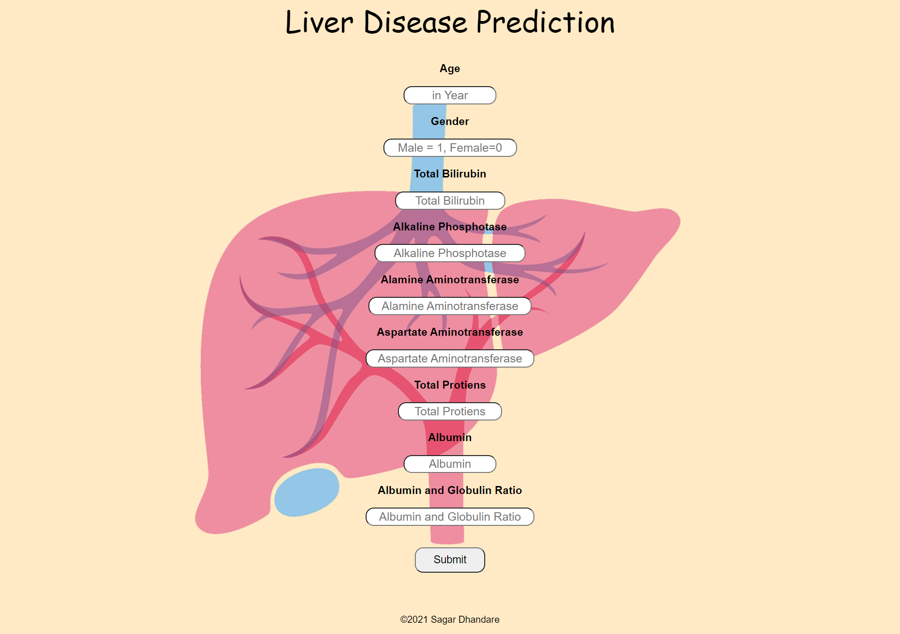

# Early Diagnosis of Liver Disease Using Machine Learning

## Project Overview
This project aims to enhance early diagnosis of liver disease using machine learning techniques. By analyzing patient data, the project seeks to classify individuals as either liver-diseased or healthy, comparing different algorithms to determine the most effective approach. Additionally, a graphical user interface (GUI) is developed to assist healthcare professionals in making quick and accurate diagnoses.

## Dataset
- **Dataset:** Indian Liver Patient Dataset with 583 records and 10 attributes.
- **Labels:** `1` indicates liver disease; `2` indicates no disease.
- **Preprocessing:**
  - Categorical data (e.g., gender) converted to numeric values.
  - Missing values in the albumin and globulin ratio columns were filled using mean imputation.
  - Data split into training (75%) and testing (25%) sets.

## Machine Learning Techniques

1. **Support Vector Machine (SVM)**
   - **Purpose:** Finds the optimal hyperplane to separate classes.
   - **Implementation:** Utilizes the RBF kernel via scikit-learn.

2. **Logistic Regression**
   - **Purpose:** Models the probability of class membership.
   - **Implementation:** Parametric model implemented using scikit-learn.

3. **K-Nearest Neighbors (K-NN)**
   - **Purpose:** Classifies based on the closest data points in the training set.
   - **Implementation:** Employs Minkowski distance for similarity measurement.

4. **Artificial Neural Network (ANN)**
   - **Purpose:** Uses backpropagation to optimize prediction accuracy.
   - **Implementation:** Built with Keras and TensorFlow, featuring two hidden layers with dropout for regularization.

## Results and Evaluation
The models were evaluated on the basis of accuracy, precision, sensitivity, and specificity. Each algorithm demonstrated strong predictive capabilities, with performance varying across different metrics.

## GUI Development
A Flask-based web application was created to offer an interactive interface for predicting liver disease. Users can input various health parameters, and the application, using a pre-trained model, provides a diagnosis prediction.

### Screenshots



## Installation and Setup

### Prerequisites
- Python 3.x
- Flask
- scikit-learn
- Keras
- TensorFlow

### Installation
1. Clone the repository:
    ```bash
    git clone https://github.com/21501a05b6/Early-Diagnosis-of-Liver-Disease-Using-Machine-Learning.git
    cd Early-Diagnosis-of-Liver-Disease-Using-Machine-Learning
    ```
2. Install the required packages:
    ```bash
    pip install 
    ```

### Running the Application
1. Start the Flask application:
    ```bash
    python app.py
    ```
2. Open your browser and navigate to `http://127.0.0.1:5000` to use the application.

## Conclusion
This project demonstrates the potential of machine learning in diagnosing liver disease, providing an effective tool for healthcare professionals. The comparison of algorithms offers insights into their performance, and the GUI facilitates easy interaction with the prediction models.

---

